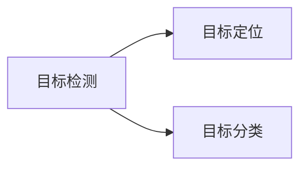
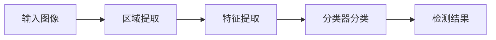
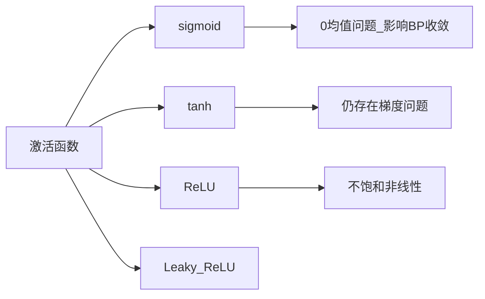
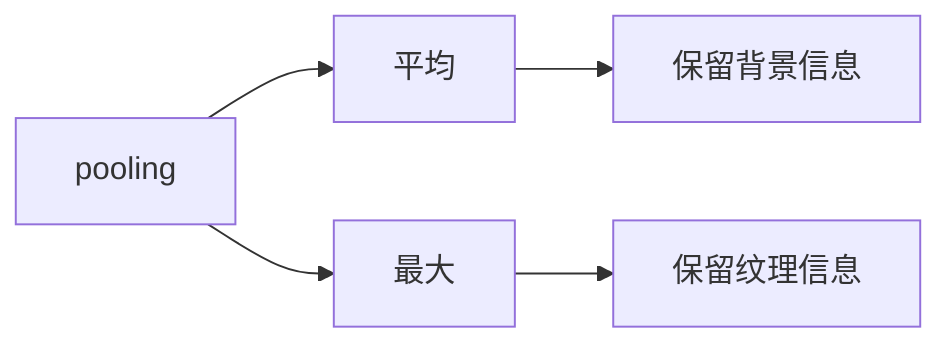
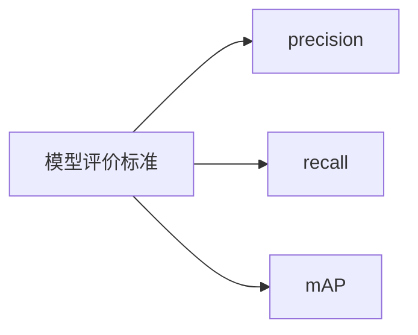

目标检测关键索引

<!-- more -->

<h2 id = 'keyword'>关键词</h2>

**上采样**  **感受野** **GoogLeNet** **Inception** **CSP** **梯度消失** **网格退化** **VGG-16** **浅层特征图** **目标重写** **多任务模块** **CIoU** **MSCOCO** **DIoU** **快速ACE算法** **HOG** **SSD** **数据关联** **栅格** **二元交叉熵损失** **反残差** **尺度不变性** **颜色空间** **特征融合** **残差网络** **恒等映射** **FPN** [**TTA**](#TTA) 

目标检测

基于RPN的目标检测算法具体流程

激活函数(active function)

YOLO系列

YOLOv1

- 网络
  - 24Conv
  - 2Conn

YOLOv2(YOLO9000)

- Darknet-19
- BN、去dropout(随机失活)
- anchor box
- k-means
- passthrough
- MS-training

SSD

- anchor box
- VGG-16

模型评价标准

<h6 id = "TTA">TTA</h6> 

TTA（测试时增强）test time augmentation：为原始图像造出多个不同的版本，包括不同区域裁剪和更改缩放程度，并将它们输入到模型中，然后对多个版本进行计算得到平均输出，作为图像的最终输出分数。

这种技术很有效，因为原始图像显示的区域可能会缺少一些重要特征，在模型中输入图像的多个版本并取平均值，能解决上述问题。
[⏎](#keyword)

